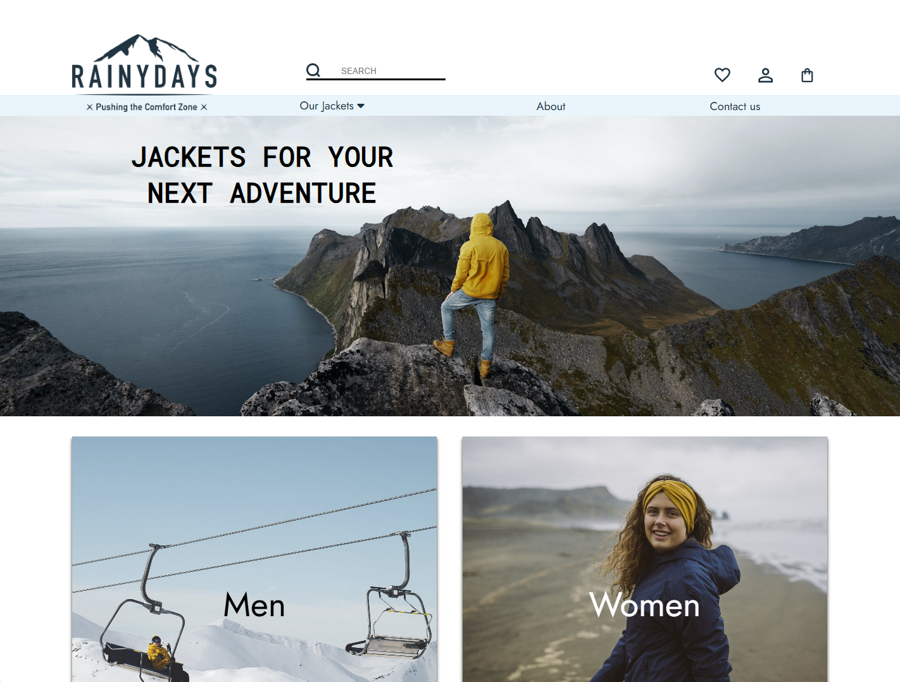

# Rainydays

Rainydays, an online shop selling men's and women's rain jackets, is used across several courses. 

## Description

The Rainydays site has been used across the following courses

### Design 1

Creating a design prototype using Figma. 

### HTML and CSS

Creating a properly functioning, responsive website.

### JavaScript 1

Fetching products from an external API.

### Content Management Systems

Converting the site into a headless CMS, fetching products from a WordPress/WooCommerce API.

## Built With

- HTML
- CSS
- JavaScript
- [WordPress](https://wordpress.org/)
- [WooCommerce](https://woocommerce.com/)

## Tools & Development Process

### User Analytics & Testing

[Hotjar](https://www.hotjar.com/) was used during development for tracking user behavior and conducting usability testing to improve the overall user experience and identify areas for optimization. 

### Content Evolution

The site was originally built with product images and information statically added directly to the HTML/CSS.  At a later stage (September 2024), the architecture was migrated to a headless CMS approach, where product data is dynamically fetched from a WordPress/WooCommerce API, allowing for easier content management and scalability.

**Note:** The WooCommerce backend is no longer active, so a static alternative is built to render items.  The code demonstrates the API integration implementation. 

## Getting Started

### Installing

The website needs two hosted components, one for the html/css, and one for WordPress. 
Also, CORS needs to be enabled on the WordPress site.

### Running

The site is hosted on https://rain-in-stord.netlify.app/. 

**Note:** The WordPress/WooCommerce backend is no longer actively hosted, so the site will not fetch and display products. This is a portfolio/demonstration project showcasing the frontend implementation and API integration architecture.

## Contributing/Contact

The project page is on https://github.com/annikaeld/Rainydays.  Raise an [issue](https://github.com/annikaeld/Rainydays/issues) on the project page if you have any feedback.
